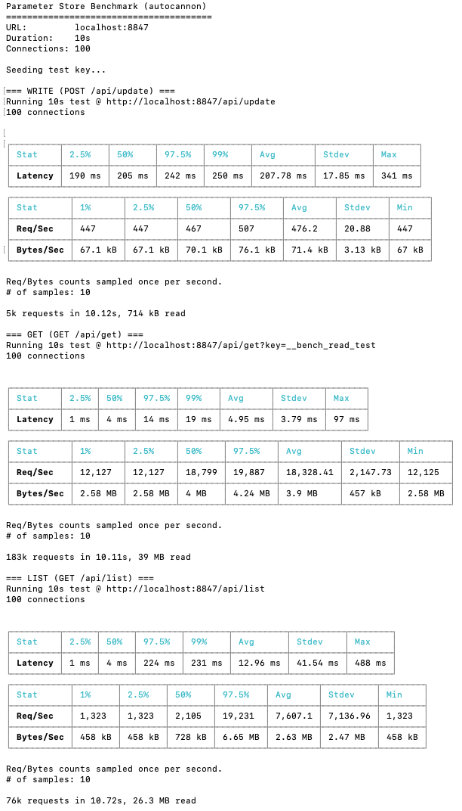
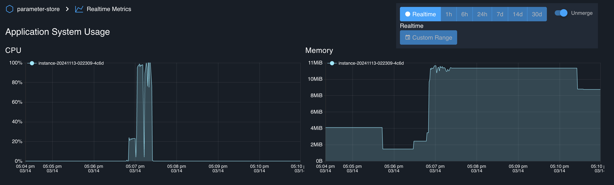

# Benchmark Results

## Environment

- **Instance**: GCP e2-micro VM (free tier)
- **vCPU**: 0.25 (shared)
- **Memory**: 1 GB
- **Tool**: autocannon
- **Connections**: 100 concurrent
- **Duration**: 10 seconds per test
- **Note**: Benchmark ran locally on the same VM. Results will vary when called from external clients due to network latency.

## Results

### WRITE (POST /api/update)

| Metric | Value |
|--------|-------|
| Avg Latency | 208 ms |
| p99 Latency | 250 ms |
| Throughput | **476 req/s** |
| Total Requests | 5k |

### GET (GET /api/get)

| Metric | Value |
|--------|-------|
| Avg Latency | 5 ms |
| p99 Latency | 19 ms |
| Throughput | **18,328 req/s** |
| Total Requests | 183k |

### LIST (GET /api/list)

| Metric | Value |
|--------|-------|
| Avg Latency | 13 ms |
| p99 Latency | 231 ms |
| Throughput | **7,607 req/s** |
| Total Requests | 76k |

## Resource Usage

- **CPU**: Spikes to ~100% during write benchmark, minimal during reads
- **Memory**: Stable at ~10 MiB throughout the test

## Summary

On a minimal e2-micro instance:
- Reads are fast (~18k req/s) due to in-memory index
- Writes are slower (~476 req/s) due to fsync for crash safety
- Memory footprint remains low and stable
